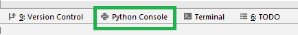
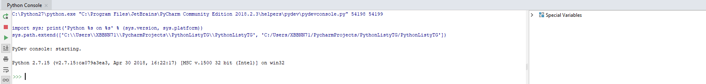

# Python
## Prework do 1 listy zadań 


## Tryb interaktywny - wprowadzenie

---

Tryb interaktywny interpretera Pythona jest podstawowym narzędziem nauki i testowania kodu. Jest bardzo podobny do powłoki bash czy powershell. Po prostu wpisujemy komendy w języku Python po czym interpreter je przetwarza i wyrzuca nam wynik podanej komendy. Ot takie proste! 

Co ciekawe, po uruchomieniu interpreter wyświetli swoją wersję, opcjonalnie wersję kompilatora C++ (język w którym został napisany Python), informację o sposobie uzyskania pomocy (polecenie help), na końcu zaś znak zachęty >>> lub In[1]. Jeżeli będziemy testować instrukcje złożone, np. warunkowe lub pętle, w interpreterze zobaczymy znaki ... oznaczające, że wprowadzany kod wymaga wcięć.

## Tryb interaktywny - jak uruchomic?

---

Aby uruchomić tryb interaktywny w programie PyCharm, kliknij Python Console w prawym dolnym rogu.



Powinno sie otworzyć okno podobne do poniższego:


## Tryb interaktywny - przykładowe użycie

---

Funkcja print() oznacza wypisanie tekstu na konsole, let's do this!

```
$ python
Python 2.7.15 
>>> print("Siema! To mój pierwszy kod Python!")
Siema! To mój pierwszy kod Python!
>>> 
```

To może teraz troche matematyki? Dodajmy do siebie dwie liczby:

```
>>> 2+2
4
>>> 
```

## Funkcja print() oraz format()

--- 

Funkcja print() służy do wypisywania tekstu na konsole. Funkcja format() jest bardzo pomocna przy formatowaniu tego co chcemy wyświetlić:  

```python
>>> print("Hello World!")
Hello World!

>>> kraj = "Polska"
>>> print("Hello {}".format(kraj))
Hello Polska
```

W miejsce klamr `{}` zostaje wrzucona zawartość zmiennej kraj czyli słowo `Polska`, a następnie funkcja print() wyświetla sformatowany tekst na konsole.

## Podstawowe typy danych 

---

* typ całkowity (*int*)
* typ zmiennoprzecinkowy (*float*)
* typ logiczny (*bool*)
* typ tekstowy (*str*)
* zmienne są typowane dynamicznie, nie trzeba definiować ich typu, python sam rozpoznaje


```python
x = 1   # [zmienna] [operator przypisania] [wartość]
y = 1.0
z = True

# drukuj typy zmiennych x, y i z (oddzielone przecinkiem)
print(type(x), type(y), type(z))
```

    (<type 'int'>, <type 'float'>, <type 'bool'>)


Znak "#" oznacza komentarz czyli fragment kodu w którym moze pisać co chcemy a python to zignoruje i przejdzie do kolejnej linii.

To by było na tyle, proste prawda?  

W takim razie <b>zapraszam</b> na nasze pierwsze zajęcia!
