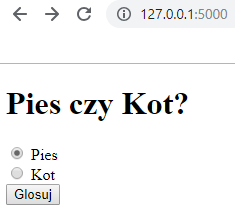
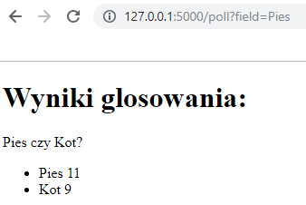

# Python

## Projekt - Pies czy Kot?

### Wymagania wstępne

`Flask` - pythonowy web framework, zapoznaj się z jego dokumentacją aby wykorzytać go w projekcie, link do dokumentacji: [Flask](http://flask.pocoo.org/).

### Opis

Stwórz aplikacje internetową, która będzie bardzo prostą ankietą stawiającą użytkownika przed najtrudniejszym wyborem: pies czy kot?   

Aplikacja ma za zadanie wyswietlać dwa wybory: kot oraz pies za pomocą których przy zaznaczeniu ktoregoś z nich użytkownik odda swój głos.  

Po naciśnięciu przycisku, aplikacja ma przejśc do nowej strony i pokazać wyniki ankiety, czyli liczbę głosów oddanych przez użytkowników.

<b>Powodzenia!</b> 

<b>Screenshoty z przykładowej implementacji projektu:</b>

