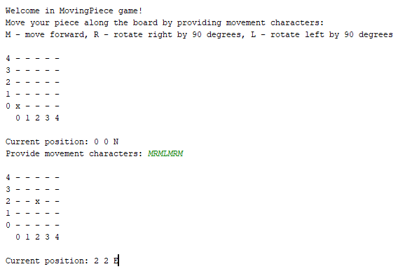
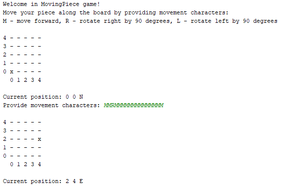

# Python
## Projekt 4 - Plansza i Klocek

W tym projekcie Twoim zadaniem będzie napisać grę, która będzie wyrysowywała planszę i miała możliwość ustawienia klocka w zadanym miejscu.

Właściwości gry: 

1. Plansza będzie miała rozmiar 5 na 5
2. Klocek może się poruszać po planszy w kierunkach: północ (N), południe (S), wschód (E), zachód (W).
3. Miejsca początkowe klocka to lewy dolny róg z kierunkiem na północ.
4. Lewy dolny róg rozumiany jest jako 0 0, lewy górny róg jako 0 4, prawy górny jako 4 4, prawy dolny jako 4 0.
5. Jesli chcesz zrobić ruch, który wykracza poza plansze to klocek powinien stanać na ostatnim możliwym miejscu na planszy.
6. Możesz założyć, że dane wejściowe od użytkownika są prawidłowe.
7. Wynik pozycji powinien być w formacie X Y KIERUNEK, czyli klocek który sie przesunął dwa miejsca w prawo i jedno do góry będzie skierowany
w kierunku północy a jego pozycja to będzie 2 1 N.
8. Znaki możliwe do wprowadzenia przez użytkownika to M (ruch), R (obrót w prawo o 90 stopni), L (obrót w lewo o 90 stopni).

Gra powinna być napisana w sposób prosty oraz powinna składać się z odzielnych modułów odpowiedzialnych za konkretne funkcjonalności i posiadać proste test jednostkowe (unit tests).

Przykłady:  
  

