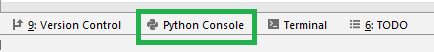
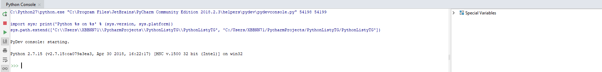

# Python
## Prework do 1 listy zadań 


## Tryb interaktywny - wprowadzenie

---

Tryb interaktywny interpretera Pythona jest podstawowym narzędziem nauki i testowania kodu. Jest bardzo podobno do powłoki bash czy powershell. Po prostu wpisujemy komendy w języku Python po czym interpreter je przetwarza i wyrzuca nam wynik podanej komendy. Ot takie proste! 

Co ciekawe, po uruchomieniu interpreter wyświetli swoją wersję, opcjonalnie wersję kompilatora C++ (język w którym został napisany Python), informację o sposobie uzyskania pomocy (polecenie help), na końcu zaś znak zachęty >>> lub In[1]. Jeżeli będziemy testować instrukcje złożone, np. warunkowe lub pętle, w interpreterze zobaczymy znaki ... oznaczające, że wprowadzany kod wymaga wcięć.

## Tryb interaktywny - jak uruchomic?

---

Aby uruchomić tryb interaktywny w programie PyCharm, kliknij Python Console w prawym dolnym rogu.



Powinno sie otworzyć okno podobne do poniższego:


## Tryb interaktywny - przykładowe użycie

---

Funkcja print() oznacza wypisanie tekstu na konsole, let's do this!

```
$ python
Python 2.7.15 
>>> print("Siema! To mój pierwszy kod Python!")
Siema! To mój pierwszy kod Python!
>>> 
```

To może teraz troche matematyki? Dodajmy do siebie dwie liczby:

```
>>> 2+2
4
>>> 
```